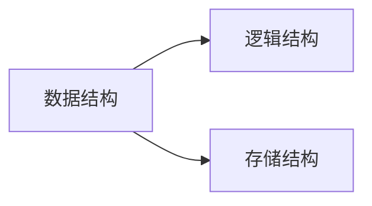
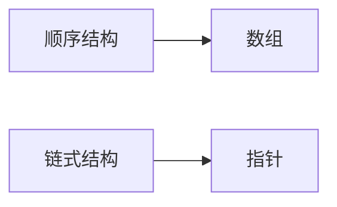
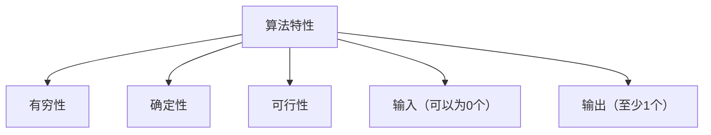
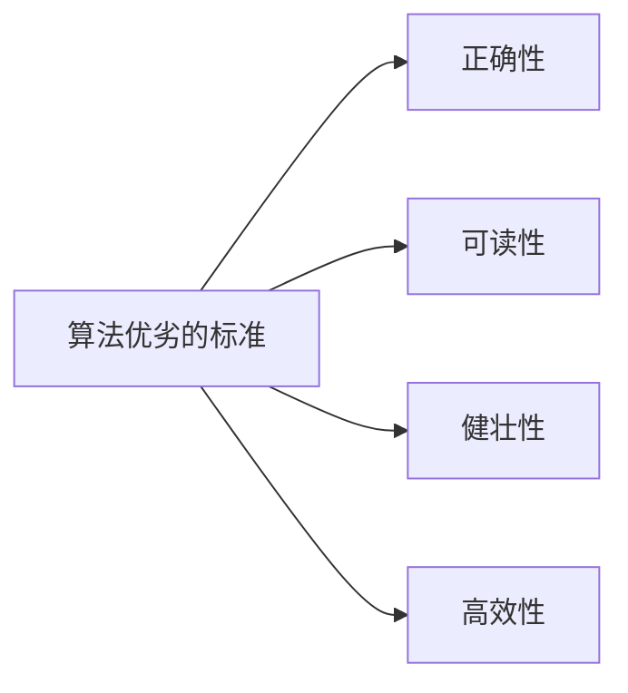

# 1 诸论

## 1.1 基本术语和概念

### 1.1.1 数据、数据元素、数据项和数据对象

**数据** ： 是客观事物的符号表示，是所有能输入到计算机中并被计算机程序处理的符号的总称。

**数据元素** ： 是`数据`的基本单位.

**数据项** ： 是组成`数据元素`的、有独立含义的、不可分割的最小单位。

**数据对象** ： 是相同性质的`数据元素`的集合，是数据的一个子集。

---

### 1.1.2 数据结构

**数据结构** ： 是相互之间存在一种或多种特定关系的`数据元素`的集合。

1. **逻辑结构** ： 数据的逻辑结构是从逻辑关系上描述数据，它与数据的存储没有关系，是独立于计算机的。

> 逻辑结构
>> 集合结构
>> 
>> 线性结构
>> 
>> 树结构
>> 
>> 图结构

2. **存储结构** ： 数据对象在计算机中的存储表示称为数据的存储结构，也称为物理结构。

> 存储结构
>> 顺序存储结构
>> 
>> 链式存储结构

---

### 1.1.3 数据类型和抽象数据类型

**数据类型** ： 一个值的集合和定义在这个值集上的一组操作的总称。

**抽象数据类型** ： 由用户定义的、表示应用问题的数学模型，以及定义在这个模型上的一组操作的总称，具体包括三部分：`数据对象`，`数据对象上关系的集合`以及`对数据对象的基本操作的集合`。

---

## 1.2 算法和算法分析

### 1.2.1 算法的定义及特性

**算法** ： 为了解决某类问题而规定的一个有限长的操作序列。

---

---

### 1.2.2 时间复杂度

**问题规模**是算法求解问题输入量的多少，是问题大小的本质表示。

一条语句重复执行的次数称作**语句频度**。

一般情况下，算法基本语句重复执行的次数是问题规模 $n$ 的某个函数 $f(n)$,算法的时间量度记作

$$ T(n)= O(f(n)) $$

它表示问题规模 $n$ 的增大，算法执行时间的增长率和 $f(n)$ 的增长率相同，称作算法的**渐近时间复杂度**，简称**时间复杂度**。

常见的时间复杂度按**数量级递增排序**：常数阶 $O(1)$ 、对数阶 $O(log_2n)$ 、线性阶 $O(n)$ 、线性对数阶 $O(nlog_2n)$ 、平方阶 $O(n^2)$ 、立方阶 $O(n^3)$ 、...... 、k次方阶 $O(n^k)$ 、指数阶 $O(2^n)$ 等。

算法在最好情况下的时间复杂度为**最好时间复杂度**，指的是算法计算量可能达到的最小值；算法在最坏情况下的时间复杂度为**最坏时间复杂度**，指的是算法计算量可能达到的最大值；算法的**平均时间复杂度**是指算法在所有可能情况下，按照输入实例以等概率出现时，算法计算量的加权平均值。

---

### 1.2.3 空间复杂度

关于算法的存储空间需求，我们采用**渐近空间复杂度**作为算法所存储空间的量度，也是问题规模 $n$ 的函数，简称**空间复杂度**。记作：

$$ S(n)=O(f(n)) $$

---

2020年2月17日

pomelo