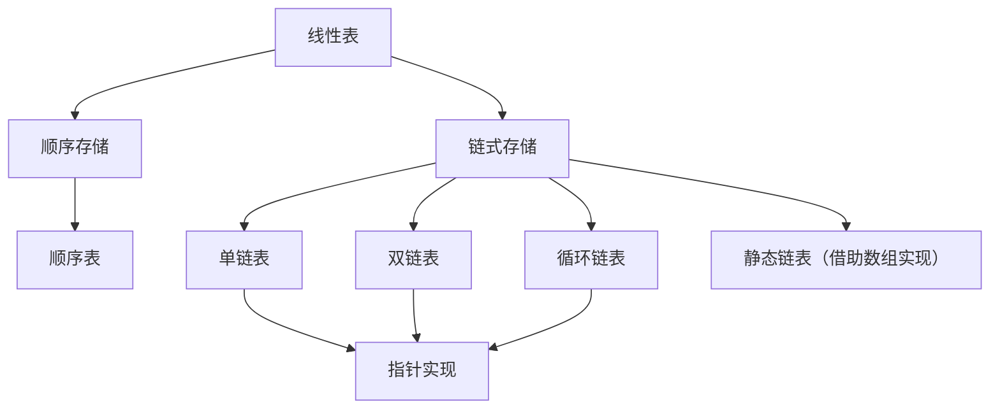

# 2 线性表

## 知识框架



---

## 2.1 线性表的定义和基本操作

### 2.1.1 线性表的定义和特点

此类由 $n (n\ge0)$ 个数据特性相同的元素构成的有限序列称为**线性表**。

线性表中元素的个数 $ n(n\ge0) $ 定义为线性表的长度，$ n=0 $ 时称为**空表**。

对于非空的线性表或线性结构，其特点是：

1. 存在唯一的一个被称作“第一个”的数据元素。
2. 存在唯一的一个被称作“最后一个”的数据元素。
3. 除第一个之外，结构中的每个数据元素均只有一个前驱。
4. 除最后一个之外，结构中的每个数据元素均只有一个后继。

---

## 2.2 线性表的顺序表示和实现

### 2.2.1 线性表的顺序存储表示

线性表的顺序表示指的是用**一组地址连续的存储地址**依次存储线性表的数据元素，这种表示也称作线性表的**顺序存储结构**或**顺序映像**。称这种存储结构的线性表为**顺序表**。特点是，**逻辑上相邻的数据元素，其物理次序也是相邻的**。

假设线性表的每个元素需占用 $l$ 个存储单元，并以所占的第一个单元的存储地址作为数据元素的存储起始位置。则线性表中第 $i+1$ 个数据元素的存储位置 $LOC(a_{i+1})$ 和第 $i$ 个数据元素的存储位置 $LOC(a_i)$ 之间满足下列关系：

$$ LOC(a_{i+1})=LOC(a_i)+l$$

一般来说，线性表的第 $i$ 个数据元素 $a_i$ 的存储位置为：

$$ LOC(a_i)=LOC(a_1)+(i-1)*l$$

线性表的顺序存储结构是一种**随机存取**的存储结构。

```C
//-----------顺序表的存储结构------------
#define MAXSIZE 100
typedef struct{
    ElemType *elem;
    int length;
}Sqlist;
```

---

```C
//----------一元多项式的顺序存储结构----------
#define MAXSIZE 100
typedef struct{
    float coef;    //系数
    int expn;      //指数
}Polynomial;
typedef struct{
    Polynomial *elem;
    int length;
}sqlist;
```

---

