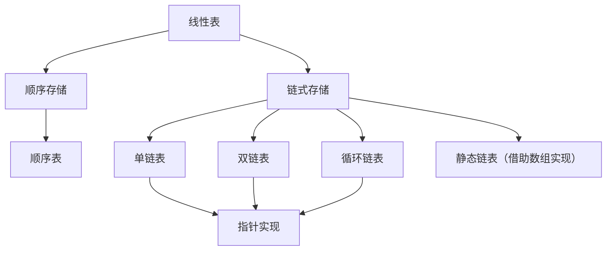

# 线性表

## 知识框架

```mermaid
graph TB
A["线性表"] --> B["顺序存储"]
A["线性表"] --> C["链式存储"]
B["顺序存储"] --> D["顺序表"]
C["链式存储"] --> E["单链表"]
C["链式存储"] --> F["双链表"]
C["链式存储"] --> G["循环链表"]
C["链式存储"] --> H["静态链表（借助数组实现）"]
E["单链表"] --> I["指针实现"]
F["双链表"] --> I["指针实现"]
G["循环链表"] -->  I["指针实现"]
```

---

## 线性表的定义和基本操作

### 线性表的定义

